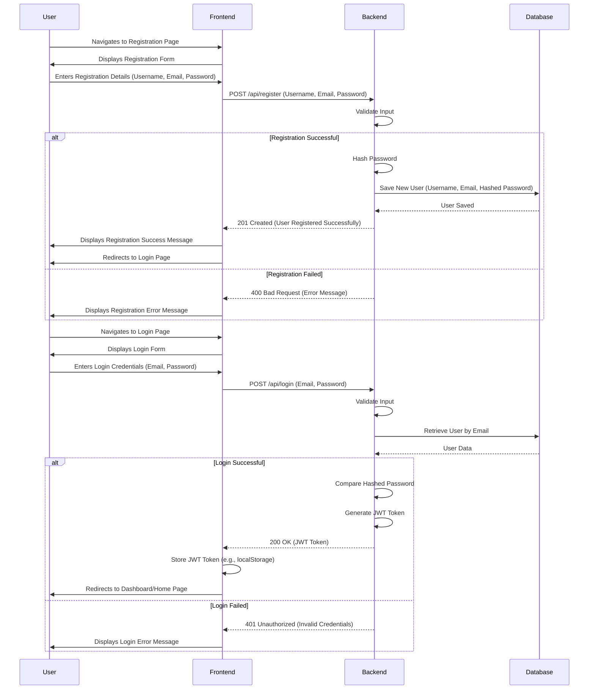

## Sequence Diagram: User Registration/Login

This diagram illustrates the sequence of interactions for a user registering and logging into the online booking system.

```mermaid
sequenceDiagram
    participant User
    participant Frontend
    participant Backend
    participant Database

    User->>Frontend: Navigates to Registration Page
    Frontend->>User: Displays Registration Form
    User->>Frontend: Enters Registration Details (Username, Email, Password)
    Frontend->>Backend: POST /api/register (Username, Email, Password)
    Backend->>Backend: Validate Input
    alt Registration Successful
        Backend->>Backend: Hash Password
        Backend->>Database: Save New User (Username, Email, Hashed Password)
        Database-->>Backend: User Saved
        Backend-->>Frontend: 201 Created (User Registered Successfully)
        Frontend->>User: Displays Registration Success Message
        Frontend->>User: Redirects to Login Page
    else Registration Failed
        Backend-->>Frontend: 400 Bad Request (Error Message)
        Frontend->>User: Displays Registration Error Message
    end

    User->>Frontend: Navigates to Login Page
    Frontend->>User: Displays Login Form
    User->>Frontend: Enters Login Credentials (Email, Password)
    Frontend->>Backend: POST /api/login (Email, Password)
    Backend->>Backend: Validate Input
    Backend->>Database: Retrieve User by Email
    Database-->>Backend: User Data
    alt Login Successful
        Backend->>Backend: Compare Hashed Password
        Backend->>Backend: Generate JWT Token
        Backend-->>Frontend: 200 OK (JWT Token)
        Frontend->>Frontend: Store JWT Token (e.g., localStorage)
        Frontend->>User: Redirects to Dashboard/Home Page
    else Login Failed
        Backend-->>Frontend: 401 Unauthorized (Invalid Credentials)
        Frontend->>User: Displays Login Error Message
    end
```

