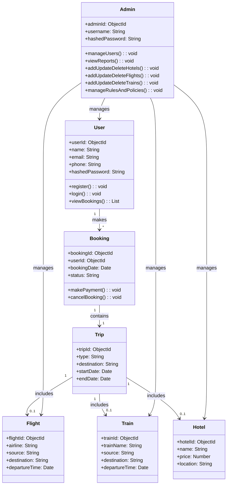

## Class Diagram Review

**Overall Impression:**
The Class Diagram outlines the main classes, their attributes, and relationships, providing a good structural view of the system. It aligns well with the ER Diagram in terms of entities and their properties.

**Suggestions for Improvement:**

1.  **Data Types:** While `int` and `string` are used, it's good practice to be more specific with data types where possible (e.g., `Date` for `bookingdate`, `boolean` for status if it's a true/false value, `float` or `decimal` for `price`). For MongoDB, the types would typically be BSON types (e.g., `ObjectId`, `String`, `Number`, `Date`, `Boolean`).

2.  **Relationships and Multiplicity:**
    *   The arrows indicate relationships (e.g., `User` `makes` `Booking`, `Booking` `contains` `Trip`). Explicitly defining the multiplicity (e.g., 1..*, 0..1, 1..1) on the relationships would make the diagram more precise. For example, a `User` can make `0..*` `Booking`s, and a `Booking` `contains` `1..1` `Trip`.
    *   The `include` relationships between `Trip` and `Hotel`, `Flight`, `Train` are good. This suggests that a `Trip` can be composed of one or more of these. In an object-oriented context, this could be represented by a `Trip` class having references or collections of `Flight`, `Train`, and `Hotel` objects.

3.  **Methods/Behaviors:** Class diagrams typically include methods (operations) that each class can perform. For example, a `User` class might have methods like `register()`, `login()`, `viewBookings()`. A `Booking` class might have `makePayment()`, `cancelBooking()`. Adding these would provide a more complete picture of the system's behavior.

4.  **Inheritance/Polymorphism:** If `Flight`, `Train`, and `Hotel` share common properties and behaviors related to being a 

bookable item, consider an abstract `BookableItem` class that they inherit from. This can simplify code and improve maintainability.

5.  **Password Storage:** As mentioned in the ER Diagram review, the `password` attribute in the `User` class should represent a hashed password (e.g., `hashedPassword: string`) rather than the plain text password.

6.  **MongoDB Mapping:** When translating this to a MongoDB schema, consider how these classes will map to collections and documents. For example, the `Booking` class might embed `Trip` details, and `Trip` might embed `Flight`, `Train`, or `Hotel` details, as discussed in the ER Diagram review. This would mean that `Flight`, `Train`, and `Hotel` might not be top-level classes in the MongoDB schema but rather embedded objects within a `Trip` document.

**Example of potential refinement (conceptual):**

This Mermaid code is an example of how you could represent a refined Class Diagram. You can use tools that support Mermaid to render this into a diagram. I will provide a rendered image of this example after reviewing all diagrams.

