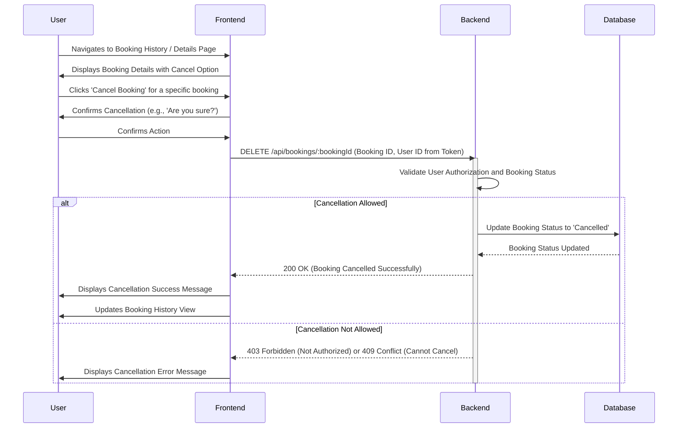

## Sequence Diagram: Cancelling a Booking

This diagram illustrates the sequence of interactions when a user cancels an existing booking.

```mermaid
sequenceDiagram
    participant User
    participant Frontend
    participant Backend
    participant Database

    User->>Frontend: Navigates to Booking History / Details Page
    Frontend->>User: Displays Booking Details with Cancel Option
    User->>Frontend: Clicks 'Cancel Booking' for a specific booking
    Frontend->>User: Confirms Cancellation (e.g., 'Are you sure?')
    User->>Frontend: Confirms Action
    Frontend->>Backend: DELETE /api/bookings/:bookingId (Booking ID, User ID from Token)
    activate Backend
    Backend->>Backend: Validate User Authorization and Booking Status
    alt Cancellation Allowed
        Backend->>Database: Update Booking Status to 'Cancelled'
        Database-->>Backend: Booking Status Updated
        Backend-->>Frontend: 200 OK (Booking Cancelled Successfully)
        Frontend->>User: Displays Cancellation Success Message
        Frontend->>User: Updates Booking History View
    else Cancellation Not Allowed
        Backend-->>Frontend: 403 Forbidden (Not Authorized) or 409 Conflict (Cannot Cancel)
        Frontend->>User: Displays Cancellation Error Message
    end
    deactivate Backend
```

