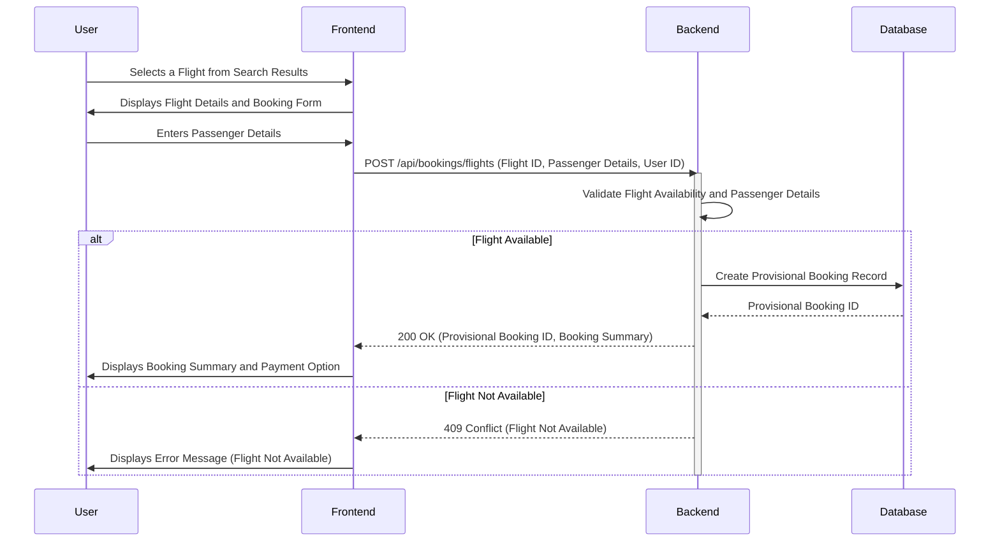

## Sequence Diagram: Making a Booking (Flight Example)

This diagram illustrates the sequence of interactions when a user makes a flight booking.

```mermaid
sequenceDiagram
    participant User
    participant Frontend
    participant Backend
    participant Database

    User->>Frontend: Selects a Flight from Search Results
    Frontend->>User: Displays Flight Details and Booking Form
    User->>Frontend: Enters Passenger Details
    Frontend->>Backend: POST /api/bookings/flights (Flight ID, Passenger Details, User ID)
    activate Backend
    Backend->>Backend: Validate Flight Availability and Passenger Details
    alt Flight Available
        Backend->>Database: Create Provisional Booking Record
        Database-->>Backend: Provisional Booking ID
        Backend-->>Frontend: 200 OK (Provisional Booking ID, Booking Summary)
        Frontend->>User: Displays Booking Summary and Payment Option
    else Flight Not Available
        Backend-->>Frontend: 409 Conflict (Flight Not Available)
        Frontend->>User: Displays Error Message (Flight Not Available)
    end
    deactivate Backend
```

