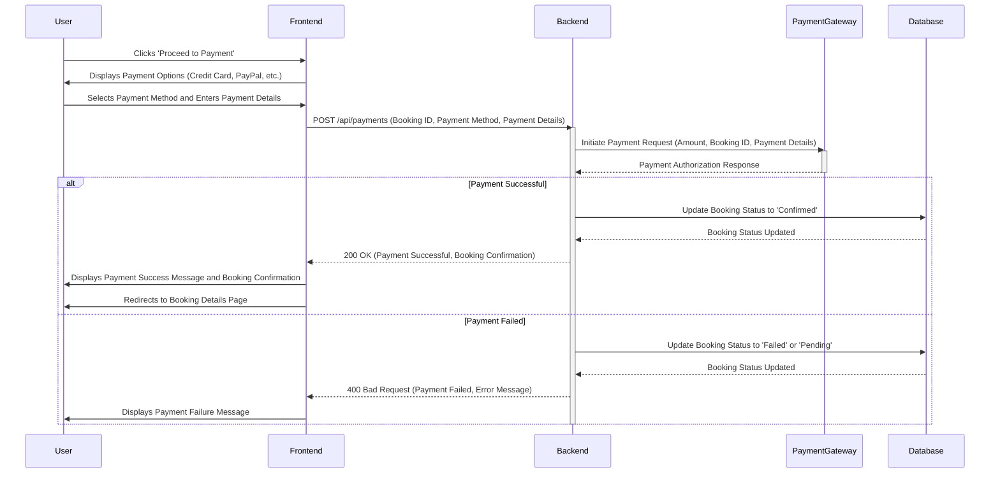

## Sequence Diagram: Making a Payment

This diagram illustrates the sequence of interactions when a user makes a payment for a booking.

```mermaid
sequenceDiagram
    participant User
    participant Frontend
    participant Backend
    participant PaymentGateway
    participant Database

    User->>Frontend: Clicks 'Proceed to Payment'
    Frontend->>User: Displays Payment Options (Credit Card, PayPal, etc.)
    User->>Frontend: Selects Payment Method and Enters Payment Details
    Frontend->>Backend: POST /api/payments (Booking ID, Payment Method, Payment Details)
    activate Backend
    Backend->>PaymentGateway: Initiate Payment Request (Amount, Booking ID, Payment Details)
    activate PaymentGateway
    PaymentGateway-->>Backend: Payment Authorization Response
    deactivate PaymentGateway

    alt Payment Successful
        Backend->>Database: Update Booking Status to 'Confirmed'
        Database-->>Backend: Booking Status Updated
        Backend-->>Frontend: 200 OK (Payment Successful, Booking Confirmation)
        Frontend->>User: Displays Payment Success Message and Booking Confirmation
        Frontend->>User: Redirects to Booking Details Page
    else Payment Failed
        Backend->>Database: Update Booking Status to 'Failed' or 'Pending'
        Database-->>Backend: Booking Status Updated
        Backend-->>Frontend: 400 Bad Request (Payment Failed, Error Message)
        Frontend->>User: Displays Payment Failure Message
    end
    deactivate Backend
```

