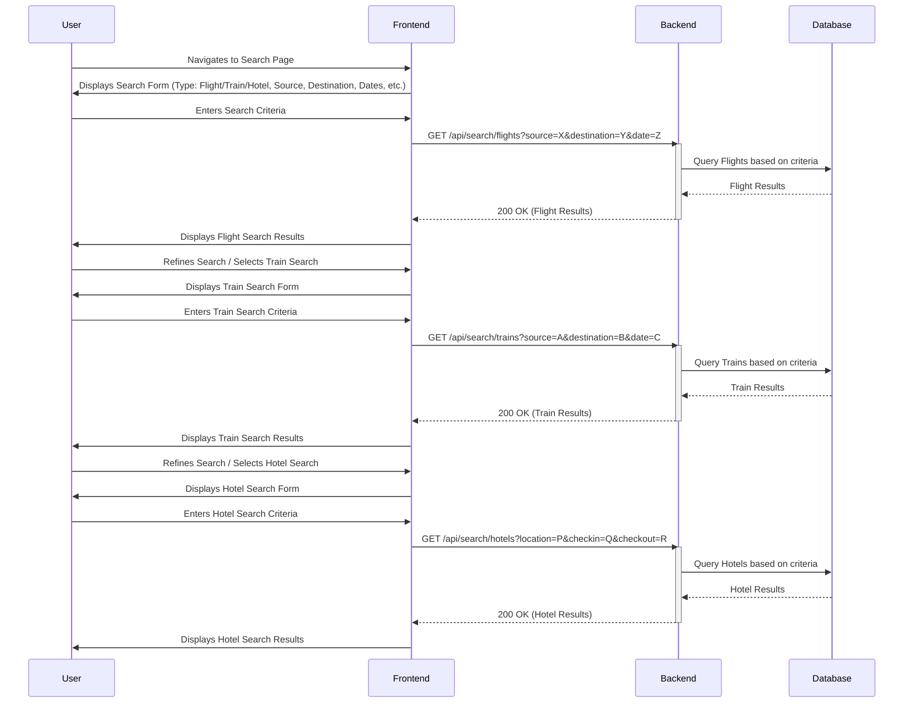

## Sequence Diagram: Searching for Trips

This diagram illustrates the sequence of interactions when a user searches for flights, trains, or hotels.

```mermaid
sequenceDiagram
    participant User
    participant Frontend
    participant Backend
    participant Database

    User->>Frontend: Navigates to Search Page
    Frontend->>User: Displays Search Form (Type: Flight/Train/Hotel, Source, Destination, Dates, etc.)
    User->>Frontend: Enters Search Criteria
    Frontend->>Backend: GET /api/search/flights?source=X&destination=Y&date=Z
    activate Backend
    Backend->>Database: Query Flights based on criteria
    Database-->>Backend: Flight Results
    Backend-->>Frontend: 200 OK (Flight Results)
    deactivate Backend
    Frontend->>User: Displays Flight Search Results

    User->>Frontend: Refines Search / Selects Train Search
    Frontend->>User: Displays Train Search Form
    User->>Frontend: Enters Train Search Criteria
    Frontend->>Backend: GET /api/search/trains?source=A&destination=B&date=C
    activate Backend
    Backend->>Database: Query Trains based on criteria
    Database-->>Backend: Train Results
    Backend-->>Frontend: 200 OK (Train Results)
    deactivate Backend
    Frontend->>User: Displays Train Search Results

    User->>Frontend: Refines Search / Selects Hotel Search
    Frontend->>User: Displays Hotel Search Form
    User->>Frontend: Enters Hotel Search Criteria
    Frontend->>Backend: GET /api/search/hotels?location=P&checkin=Q&checkout=R
    activate Backend
    Backend->>Database: Query Hotels based on criteria
    Database-->>Backend: Hotel Results
    Backend-->>Frontend: 200 OK (Hotel Results)
    deactivate Backend
    Frontend->>User: Displays Hotel Search Results
```

