## Use Case Diagram Review

**Overall Impression:**
The Use Case Diagram provides a good high-level overview of the system's functionality and the interactions between users and the system. It clearly identifies the main actors and their primary actions.

**Suggestions for Improvement:**

1.  **Actor Naming:** The diagram uses a generic 'User' actor and another unnamed actor. It would be clearer to explicitly name the second actor, likely 'Admin' or 'System Administrator', to distinguish their roles.

2.  **Refine 'Make Booking' and Specific Booking Use Cases:**
    *   The use case 'Make Booking' is very general, while 'Book Flight', 'Book Train', and 'Reserve Hotel' are specific. Consider if 'Make Booking' is necessary as a separate top-level use case. It might be better represented as an abstract use case that 'Book Flight', 'Book Train', and 'Reserve Hotel' specialize or extend.
    *   Alternatively, if 'Make Booking' is intended to be a general process that encompasses all types of bookings, then 'Book Flight', 'Book Train', and 'Reserve Hotel' could be included or extended by 'Make Booking'.

3.  **'Make Payment' Use Case:** 'Make Payment' is typically a step within a booking process rather than a standalone top-level use case. It could be shown as an `<<include>>` relationship from 'Make Booking' (or 'Book Flight/Train/Hotel') to 'Make Payment'.

4.  **'Plan Trip' Use Case:** 'Plan Trip' is a bit ambiguous. If it involves saving search results or creating itineraries without immediate booking, it's fine. If it's simply part of the 'Search Trips' process, it might be redundant.

5.  **Clarity on Relationships:** While the lines indicate relationships, adding `<<include>>` or `<<extend>>` stereotypes where appropriate (e.g., for 'Login' or 'Make Payment') would enhance the diagram's precision and adherence to UML standards.

**Example of potential refinement (conceptual):**

```mermaid
graph TD
    actor_user[User]
    actor_admin[Admin]

    subgraph Customer Actions
        uc_register[Register Account]
        uc_login[Login]
        uc_search_trips[Search Trips]
        uc_view_history[View Booking History]
        uc_download_ticket[Download Ticket/Invoice]
        uc_cancel_booking[Cancel Booking]
        uc_book_flight[Book Flight]
        uc_book_train[Book Train]
        uc_reserve_hotel[Reserve Hotel]
        uc_make_payment[Make Payment]

        uc_register -- includes --> uc_login
        uc_book_flight -- includes --> uc_make_payment
        uc_book_train -- includes --> uc_make_payment
        uc_reserve_hotel -- includes --> uc_make_payment
    end

    subgraph Admin Actions
        uc_manage_user[Manage User]
        uc_view_report[View Report]
        uc_add_update_delete_hotels[Add/Update/Delete Hotels]
        uc_add_update_delete_flights[Add/Update/Delete Flights]
        uc_add_update_delete_trains[Add/Update/Delete Trains]
        uc_rules_policies[Manage Rules & Policies]
    end

    actor_user --> uc_register
    actor_user --> uc_login
    actor_user --> uc_search_trips
    actor_user --> uc_view_history
    actor_user --> uc_download_ticket
    actor_user --> uc_cancel_booking
    actor_user --> uc_book_flight
    actor_user --> uc_book_train
    actor_user --> uc_reserve_hotel

    actor_admin --> uc_manage_user
    actor_admin --> uc_view_report
    actor_admin --> uc_add_update_delete_hotels
    actor_admin --> uc_add_update_delete_flights
    actor_admin --> uc_add_update_delete_trains
    actor_admin --> uc_rules_policies
```

This Mermaid code is an example of how you could represent a refined Use Case Diagram. You can use tools that support Mermaid to render this into a diagram. I will provide a rendered image of this example after reviewing all diagrams.

