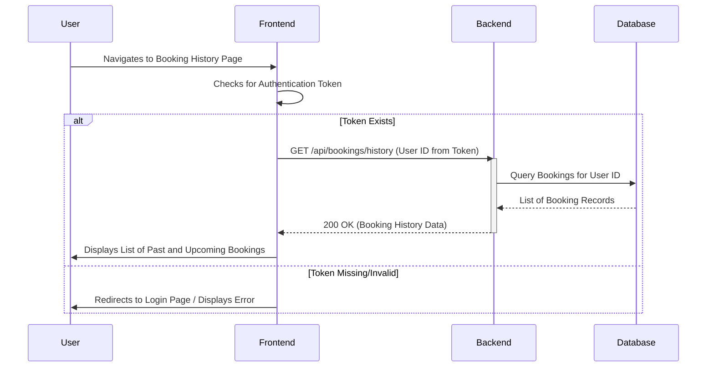

## Sequence Diagram: Viewing Booking History

This diagram illustrates the sequence of interactions when a user views their booking history.

```mermaid
sequenceDiagram
    participant User
    participant Frontend
    participant Backend
    participant Database

    User->>Frontend: Navigates to Booking History Page
    Frontend->>Frontend: Checks for Authentication Token
    alt Token Exists
        Frontend->>Backend: GET /api/bookings/history (User ID from Token)
        activate Backend
        Backend->>Database: Query Bookings for User ID
        Database-->>Backend: List of Booking Records
        Backend-->>Frontend: 200 OK (Booking History Data)
        deactivate Backend
        Frontend->>User: Displays List of Past and Upcoming Bookings
    else Token Missing/Invalid
        Frontend->>User: Redirects to Login Page / Displays Error
    end
```

