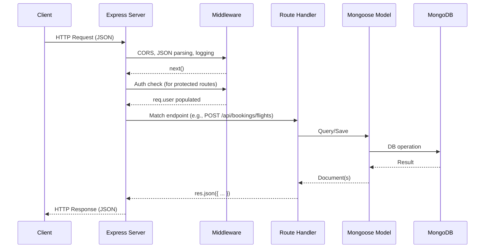
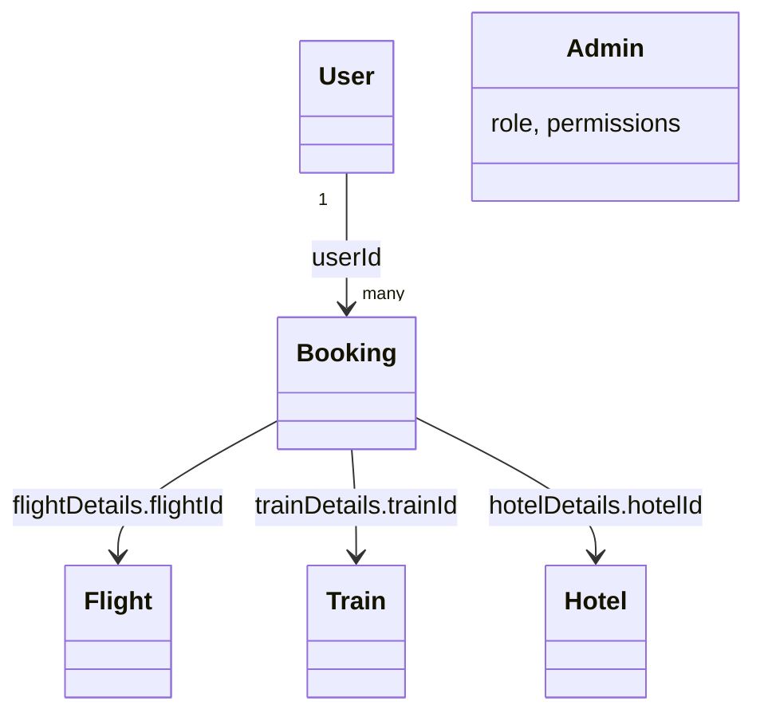
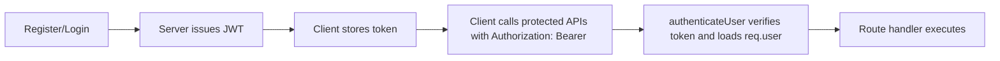

# Online Booking System – Beginner’s Mastery Guide

This guide explains everything used in your repository in plain language. You’ll learn what each technology is, how the backend works end-to-end, and how to answer any question an examiner might ask. It includes diagrams, flowcharts, and real code references from your project.

Table of contents
- Part 1: Big picture overview
- Part 2: What is an API (and how your API works)
- Part 3: What is Node.js, Express, CORS, JWT, MongoDB, Mongoose
- Part 4: Request lifecycle: from client to database and back
- Part 5: Environment and configuration
- Part 6: Data models (MongoDB schemas)
- Part 7: Middleware (auth, rate limiting, permissions)
- Part 8: Routes and features (Auth, Search, Bookings, Users, Admin)
- Part 9: Real-time admin stream (SSE) and Event Bus
- Part 10: Logging and debugging
- Part 11: How to add your own feature
- Part 12: FAQ and examiner-style Q&A


Part 1: Big picture overview

Your project is a typical web backend:
- Client (browser or Postman) sends HTTP requests
- Backend server (Node.js + Express) receives requests on endpoints like /api/auth/login
- Middleware handles security (JWT auth), CORS, parsing JSON, rate limits
- Controllers/Routes run logic and talk to MongoDB via Mongoose models
- MongoDB stores documents for users, flights, trains, hotels, and bookings
- Responses are sent back as JSON
- Admin can watch real-time events (user registered, booking created) via SSE

Visual map
```mermaid
flowchart LR
  A[Client (Browser / Postman)] -->|HTTP JSON| B[Express App]
  B --> C[CORS / JSON parser / Logger]
  C --> D{Route Match}
  D -->|/api/auth| E[Auth Router]
  D -->|/api/search| F[Search Router]
  D -->|/api/bookings| G[Bookings Router]
  D -->|/api/users| H[Users Router]
  D -->|/api/admin| I[Admin Router]
  E --> J[User/Admin Models]
  F --> K[Flight/Train/Hotel Models]
  G --> L[Booking + Item Models]
  H --> J
  I --> All[All Models]
  subgraph DB[MongoDB]
    M[Mongoose ODM]
  end
  J --> M
  K --> M
  L --> M
  All --> M
  M --> DB
  G -- emits --> SSE((Event Bus))
  SSE -- streams --> Admin[Admin Panel via /api/admin/stream]
```


Part 2: What is an API (and how your API works)

- API (Application Programming Interface): a set of rules for how programs talk to each other. In web apps, it’s usually HTTP endpoints that send/receive JSON.
- REST API: uses HTTP methods (GET, POST, PUT, DELETE) on resource URLs.
- Your API base path is /api with subpaths:
  - /api/auth: login, register, profile
  - /api/search: find flights, trains, hotels
  - /api/bookings: create/cancel bookings, pay, get tickets
  - /api/users: profile and stats
  - /api/admin: admin-only management and analytics

How your app wires routes
```js path=C:\online_booking_system\Online Booking System Project_ Step-by-Step Guide\backend\server.js start=148
// Routes
app.use('/api/auth', authRoutes);
app.use('/api/search', searchRoutes);
app.use('/api/bookings', bookingRoutes);
app.use('/api/users', userRoutes);
app.use('/api/admin', adminRoutes);
```

How to make an API endpoint (in Express)
- Create a router file (e.g., backend/routes/search.js)
- Define routes like router.get('/flights', handler)
- Export router and mount it in server.js with app.use('/api/search', router)

Example from your code
```js path=C:\online_booking_system\Online Booking System Project_ Step-by-Step Guide\backend\routes\search.js start=7
// Search flights
router.get('/flights', async (req, res) => {
  try {
    const { source, destination, date, airline } = req.query;
    // Build query and return results ...
    const flights = await Flight.find(query).sort({ departureTime: 1 }).limit(50);
    res.status(200).json({ count: flights.length, flights });
  } catch (error) {
    res.status(500).json({ error: { message: "Internal server error", status: 500, details: error.message } });
  }
});
```

How to connect to your API (from a frontend)
- Use fetch or axios with the correct base URL (e.g., http://localhost:3000)
- Send Authorization header with Bearer <token> for protected routes

Example
```js path=null start=null
const BASE = 'http://localhost:3000';
const token = localStorage.getItem('token');
const res = await fetch(`${BASE}/api/bookings/history`, {
  headers: { Authorization: `Bearer ${token}` }
});
const data = await res.json();
```


Part 3: What is Node.js, Express, CORS, JWT, MongoDB, Mongoose

- Node.js: JavaScript runtime for servers. Lets you write backend code in JS.
- Express: Minimal framework for routing and middleware on top of Node.js.
- CORS: Security policy that controls which origins (websites) can call your backend from browsers.
  - In your app, only allowedOrigins (like localhost ports) can call the API in dev.
```js path=C:\online_booking_system\Online Booking System Project_ Step-by-Step Guide\backend\server.js start=15
// CORS Configuration
const allowedOrigins = process.env.NODE_ENV === 'production' 
  ? ['https://yourdomain.com', 'https://www.yourdomain.com']
  : ['http://localhost:3000','http://127.0.0.1:3000','http://localhost:5500','http://127.0.0.1:5500','http://localhost:8000','http://127.0.0.1:8000'];

app.use(cors({
  origin: (origin, callback) => {
    if (!origin) return callback(null, true);
    if (allowedOrigins.includes(origin) || isDevLocalhost(origin)) callback(null, true);
    else callback(new Error('Not allowed by CORS'));
  },
  credentials: true,
  methods: ['GET','POST','PUT','DELETE','OPTIONS'],
  allowedHeaders: ['Content-Type','Authorization'],
  maxAge: 86400
}));
```
- JWT (JSON Web Tokens): Signed tokens that prove identity. Server issues token at login; clients send it in Authorization header. Your middleware verifies it and loads the user/admin.
```js path=C:\online_booking_system\Online Booking System Project_ Step-by-Step Guide\backend\routes\auth.js start=161
// Generate JWT token
const token = jwt.sign(
  { id: user._id },
  process.env.JWT_SECRET,
  { expiresIn: process.env.JWT_EXPIRES_IN }
);
```
```js path=C:\online_booking_system\Online Booking System Project_ Step-by-Step Guide\backend\middleware\auth.js start=68
// Middleware to verify user JWT token
exports.authenticateUser = async (req, res, next) => {
  const authHeader = req.headers.authorization;
  if (!authHeader || !authHeader.startsWith('Bearer ')) return res.status(401).json({ error: { message: 'Authentication failed. Invalid authorization header format.', status: 401 } });
  const token = authHeader.split(' ')[1];
  const decoded = jwt.verify(token, process.env.JWT_SECRET, { algorithms: ['HS256'], maxAge: process.env.JWT_EXPIRES_IN || '24h' });
  const user = await User.findById(decoded.id);
  if (!user) return res.status(401).json({ error: { message: 'Authentication failed. User not found.', status: 401 } });
  req.user = user; req.userId = user._id.toString(); next();
};
```
- MongoDB: NoSQL database that stores documents (JSON-like). Collections here: users, admins, flights, trains, hotels, bookings
- Mongoose: ODM (Object Data Modeling) library for MongoDB. You define schemas and get Models that you can use to query.
```js path=C:\online_booking_system\Online Booking System Project_ Step-by-Step Guide\backend\models\Booking.js start=201
// Main Booking Schema
const bookingSchema = new mongoose.Schema({
  userId: { type: mongoose.Schema.Types.ObjectId, ref: 'User', required: true },
  bookingType: { type: String, required: true, enum: ['flight','train','hotel','multi'], trim: true },
  bookingDate: { type: Date, default: Date.now },
  status: { type: String, enum: ['pending','confirmed','cancelled','failed'], default: 'pending' },
  totalAmount: { type: Number, required: true, min: [0, 'Total amount cannot be negative'] },
  paymentStatus: { type: String, enum: ['pending','completed','failed','refunded'], default: 'pending' },
  paymentId: { type: String, trim: true },
  cancellationReason: { type: String, trim: true },
  cancelledAt: { type: Date },
  trip: tripSchema
}, { timestamps: true });
```


Part 4: Request lifecycle: from client to database and back

Request flow chart



Part 5: Environment and configuration

- .env controls secrets and settings
- Key variables (see backend/.env.example):
  - MONGODB_URI: your database address
  - JWT_SECRET and JWT_EXPIRES_IN: token signing and validity
  - PORT, NODE_ENV: server port/environment
  - DEBUG: enables debug output (booking:*)
```ini path=C:\online_booking_system\Online Booking System Project_ Step-by-Step Guide\backend\.env.example start=4
MONGODB_URI=mongodb://localhost:27017/online_booking_system
JWT_SECRET=your_super_secret_jwt_key_here_please_change_this_in_production
JWT_EXPIRES_IN=7d
PORT=3000
NODE_ENV=development
DEBUG=booking:*
```

MongoDB connection with retry logic
```js path=C:\online_booking_system\Online Booking System Project_ Step-by-Step Guide\backend\server.js start=101
const connectToMongoDB = async (retryCount = 0) => {
  try {
    await mongoose.connect(process.env.MONGODB_URI, { useNewUrlParser: true, useUnifiedTopology: true, serverSelectionTimeoutMS: 10000, heartbeatFrequencyMS: 2000, maxPoolSize: 10, minPoolSize: 2 });
    console.log('✅ Successfully connected to MongoDB');
    mongoose.connection.on('error', (error) => console.error('❌ MongoDB connection error:', error));
    mongoose.connection.on('disconnected', () => console.warn('⚠️  MongoDB disconnected. Attempting to reconnect...'));
    mongoose.connection.on('reconnected', () => console.log('✅ MongoDB reconnected successfully'));
  } catch (error) {
    // Retry up to 5 times
  }
};
```


Part 6: Data models (MongoDB schemas)

1) User
- Fields: name, email (unique), phone, passwordHash
- Passwords are hashed with bcrypt in a pre-save hook
- Methods: comparePassword, toJSON (hides passwordHash)
```js path=C:\online_booking_system\Online Booking System Project_ Step-by-Step Guide\backend\models\User.js start=37
// Hash password before saving
userSchema.pre('save', async function(next) {
  if (!this.isModified('passwordHash')) return next();
  const salt = await bcrypt.genSalt(10);
  this.passwordHash = await bcrypt.hash(this.passwordHash, salt);
  next();
});
```

2) Admin
- Similar to User plus role and permissions array
- Roles: admin, super_admin; permissions: manage_users, manage_flights, manage_trains, manage_hotels, view_reports

3) Flight
- Includes times, price, seats, and ensures arrival after departure; prevents availableSeats > totalSeats

4) Train
- Similar constraints as Flight, with class and seats

5) Hotel
- Location, address, price per night, rating, room counts, roomType

6) Booking
- References a user, holds bookingType, status, payment status, and a nested trip object with specific details for flight/train/hotel

ER-style relationships (simplified)



Part 7: Middleware (auth, rate limiting, permissions)

- authenticateUser: verifies JWT, loads req.user
- authenticateAdmin: verifies JWT, loads req.admin
- checkPermission('permission'): ensures admin has required rights (or is super_admin)
- rateLimitAuth: limits repeated login attempts per IP
```js path=C:\online_booking_system\Online Booking System Project_ Step-by-Step Guide\backend\middleware\auth.js start=197
exports.checkPermission = (permission) => {
  return (req, res, next) => {
    if (!req.admin) return res.status(401).json({ error: { message: 'Authentication failed. Admin not found.', status: 401 } });
    const perms = Array.isArray(req.admin.permissions) ? req.admin.permissions : [];
    if (req.admin.role === 'super_admin' || perms.includes(permission)) next();
    else return res.status(403).json({ error: { message: 'Access denied. Insufficient permissions.', status: 403 } });
  };
};
```

Auth flow



Part 8: Routes and features

8.1 Authentication (/api/auth)
- POST /register: validate input, save User, emit event, sign token
- POST /login: rate-limited, check email+password, sign token
- POST /admin/login: admin login with role
- GET /me: returns current user (requires authenticateUser)
- PUT /change-password: verifies current password and updates
```js path=C:\online_booking_system\Online Booking System Project_ Step-by-Step Guide\backend\routes\auth.js start=110
// User Login
router.post('/login', rateLimitAuth, async (req, res) => {
  const { email, password } = req.body;
  const user = await User.findOne({ email });
  if (!user) { recordFailedAuth(req); return res.status(401).json({ error: { message: 'Invalid credentials', status: 401 } }); }
  const isMatch = await user.comparePassword(password);
  if (!isMatch) { recordFailedAuth(req); return res.status(401).json({ error: { message: 'Invalid credentials', status: 401 } }); }
  clearAuthAttempts(req);
  const token = jwt.sign({ id: user._id }, process.env.JWT_SECRET, { expiresIn: process.env.JWT_EXPIRES_IN });
  res.status(200).json({ message: 'Login successful', user: { _id: user._id, name: user.name, email: user.email, phone: user.phone }, token });
});
```

8.2 Search (/api/search)
- GET /flights: query by source, destination, airline, date; enforces future departures
- GET /trains: similar but simpler date logic
- GET /hotels: filter by location, rating, roomType

8.3 Bookings (/api/bookings)
- POST /flights | /trains | /hotels: create bookings, update availability, emit booking:created event
- POST /bulk: create many bookings in one request (group)
- POST /:id/payment: mock payment success and update booking
- GET /history: current user’s bookings
- GET /:id: specific booking (only if owner)
- DELETE /:id and PUT /:id/cancel: cancel booking and restore availability
- GET /ticket/:bookingId and POST /group-ticket: generate professional PDF tickets via pdfkit
```js path=C:\online_booking_system\Online Booking System Project_ Step-by-Step Guide\backend\routes\bookings.js start=11
// Create flight booking
router.post("/flights", authenticateUser, async (req, res) => {
  const { flightId, passengerDetails } = req.body;
  const flight = await Flight.findById(flightId);
  // validate + create Booking + decrement availableSeats + emit event + return JSON
});
```

8.4 Users (/api/users)
- GET /profile, PUT /profile
- GET /stats: aggregates bookings by type and status for the current user

8.5 Admin (/api/admin)
- Protected by authenticateAdmin and checkPermission
- Manage users, flights, trains, hotels
- Analytics endpoints (overview, booking types, status, routes, revenue) described in “Online Booking System - Backend API.md”


Part 9: Real-time admin stream (SSE) and Event Bus

- Event Bus: a simple EventEmitter shared across the app
- When a user registers or a booking is created, the event is emitted
- Server pushes events to connected admin panels via Server-Sent Events (SSE) at /api/admin/stream
```js path=C:\online_booking_system\Online Booking System Project_ Step-by-Step Guide\backend\utils\eventBus.js start=1
const EventEmitter = require('events');
class EventBus extends EventEmitter {}
module.exports = new EventBus();
```
```js path=C:\online_booking_system\Online Booking System Project_ Step-by-Step Guide\backend\server.js start=37
// SSE endpoint
app.get('/api/admin/stream', (req, res) => {
  res.setHeader('Content-Type', 'text/event-stream');
  // register client and stream events...
});
// Subscribe events to broadcast
['user:registered', 'booking:created'].forEach((evt) => {
  eventBus.on(evt, (payload) => broadcast(evt, payload));
});
```

SSE flow
```mermaid
sequenceDiagram
  participant AdminUI
  participant Server
  participant Bus as EventBus

  AdminUI->>Server: GET /api/admin/stream (keep-alive)
  Server-->>AdminUI: event: user:registered / booking:created
  Note over Bus,Server: Routes emit events to Bus; Server broadcasts to SSE clients
```


Part 10: Logging and debugging

- Console logging with colors and timestamps in utils/logger.js
- Namespaced debug via DEBUG=booking:* (see .env.example)
- Request logging middleware example in server.js and utils/logger.js
- Health check endpoint: GET /api/health
```js path=C:\online_booking_system\Online Booking System Project_ Step-by-Step Guide\backend\server.js start=183
app.get('/api/health', (req, res) => {
  res.json({ status: 'OK', message: 'Online Booking System API is running', timestamp: new Date().toISOString() });
});
```


Part 11: How to add your own feature

Example: Add a “Car Rentals” resource with search and bookings
1) Create model backend/models/Car.js with fields like carType, pricePerDay, location, availableUnits
2) Create routes backend/routes/cars.js
   - GET /api/cars/search?location=...&type=...
   - POST /api/cars/book (authenticateUser) to create a booking with trip.carDetails
3) Update server.js
   - const carRoutes = require('./routes/cars');
   - app.use('/api/cars', carRoutes);
4) Update Booking schema (if you want rich carDetails) similar to flight/train/hotel
5) Add admin endpoints to manage cars using authenticateAdmin + checkPermission('manage_cars')
6) Test with Postman and add to API docs

Checklist for any new route
- Validate input (types, formats, required fields)
- Handle auth for protected routes
- Use models to query MongoDB
- Return consistent JSON with status codes
- Emit events (optional) for admin SSE
- Add indexes to the model for performance


Part 12: FAQ and examiner-style Q&A

Q: What is the difference between authentication and authorization?
- Authentication verifies identity (JWT token proves who you are). Authorization checks permissions/roles (checkPermission for admin actions).

Q: Where are tokens stored and how are they validated?
- Client stores JWT (e.g., localStorage). Server validates with jwt.verify using the JWT_SECRET. authenticateUser loads req.user.

Q: How does CORS protect the API?
- It restricts which web origins can make browser-based requests. Your config whitelists localhost ports during development and enforces a strict list in production.

Q: How does the app prevent brute-force login attempts?
- rateLimitAuth limits attempts per IP and lockout time; recordFailedAuth and clearAuthAttempts track state.

Q: What happens when a booking is created?
- Validate input -> fetch item (flight/train/hotel) -> create Booking -> decrement availability -> emit booking:created -> return JSON.

Q: How are passwords secured?
- bcrypt hashes passwords with salt in pre-save hooks; plaintext is never stored. comparePassword checks hashes at login.

Q: What are common error response structures?
- { error: { message, status, details } } with appropriate HTTP status codes (400, 401, 404, 409, 500, etc.).

Q: How would you scale this system?
- Use connection pooling (already configured), add indexes (already present), paginate responses, add caching (e.g., Redis), move static files to CDN, containerize with Docker, use horizontal scaling and a load balancer, implement rate limiting and circuit breakers.

Q: How does the real-time admin view work?
- Admin page keeps an open SSE connection to /api/admin/stream; server pushes events when user registers or a booking is created via EventBus.

Q: How do you run the system locally?
- See backend/RUN_INSTRUCTIONS.md. In short: npm install, copy env.example to .env, start MongoDB, run node data_manager.js --action=setup (optional), then node server.js. Test with GET http://localhost:3000/api/health.

You now have the concepts, code references, and end-to-end understanding to both explain this project and extend it confidently.
