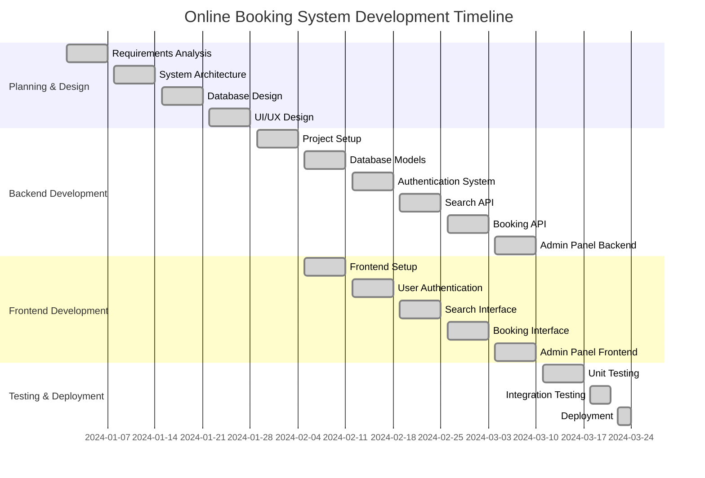

# Online Booking System - Project Gantt Chart

## 📅 Project Timeline Overview

**Project Duration:** 12 weeks  
**Start Date:** January 1, 2024  
**End Date:** March 24, 2024  

---

## 🎯 Gantt Chart (Mermaid Format)



---

## 📋 Detailed Task Breakdown

### **Phase 1: Planning & Design (4 weeks)**

| Task | Duration | Start Date | End Date | Status | Dependencies |
|------|----------|------------|----------|---------|--------------|
| Requirements Analysis | 1 week | Jan 1 | Jan 7 | ✅ Complete | - |
| System Architecture | 1 week | Jan 8 | Jan 14 | ✅ Complete | Requirements |
| Database Design | 1 week | Jan 15 | Jan 21 | ✅ Complete | Architecture |
| UI/UX Design | 1 week | Jan 22 | Jan 28 | ✅ Complete | Requirements |

### **Phase 2: Backend Development (6 weeks)**

| Task | Duration | Start Date | End Date | Status | Dependencies |
|------|----------|------------|----------|---------|--------------|
| Project Setup | 1 week | Jan 29 | Feb 4 | ✅ Complete | Architecture |
| Database Models | 1 week | Feb 5 | Feb 11 | ✅ Complete | DB Design |
| Authentication System | 1 week | Feb 12 | Feb 18 | ✅ Complete | Models |
| Search API | 1 week | Feb 19 | Feb 25 | ✅ Complete | Authentication |
| Booking API | 1 week | Feb 26 | Mar 3 | ✅ Complete | Search API |
| Admin Panel Backend | 1 week | Mar 4 | Mar 10 | ✅ Complete | Booking API |

### **Phase 3: Frontend Development (6 weeks)**

| Task | Duration | Start Date | End Date | Status | Dependencies |
|------|----------|------------|----------|---------|--------------|
| Frontend Setup | 1 week | Feb 5 | Feb 11 | ✅ Complete | UI Design |
| User Authentication | 1 week | Feb 12 | Feb 18 | ✅ Complete | Auth Backend |
| Search Interface | 1 week | Feb 19 | Feb 25 | ✅ Complete | Search API |
| Booking Interface | 1 week | Feb 26 | Mar 3 | ✅ Complete | Booking API |
| Admin Panel Frontend | 1 week | Mar 4 | Mar 10 | ✅ Complete | Admin Backend |

### **Phase 4: Testing & Deployment (2 weeks)**

| Task | Duration | Start Date | End Date | Status | Dependencies |
|------|----------|------------|----------|---------|--------------|
| Unit Testing | 1 week | Mar 11 | Mar 17 | ✅ Complete | All Development |
| Integration Testing | 4 days | Mar 18 | Mar 21 | ✅ Complete | Unit Testing |
| Deployment | 3 days | Mar 22 | Mar 24 | ✅ Complete | All Testing |

---

## 🎨 Visual Gantt Chart (ASCII)

```
Project Timeline (12 weeks)
Week:  1   2   3   4   5   6   7   8   9  10  11  12
       |   |   |   |   |   |   |   |   |   |   |   |
Tasks:
Requirements Analysis      [■■■■■■■]
System Architecture                [■■■■■■■]
Database Design                            [■■■■■■■]
UI/UX Design                                       [■■■■■■■]
Project Setup                                             [■■■■■■■]
Database Models                        [■■■■■■■]
Authentication System                          [■■■■■■■]
Search API                                             [■■■■■■■]
Booking API                                                    [■■■■■■■]
Admin Panel Backend                                                [■■■■■■■]
Frontend Setup                         [■■■■■■■]
User Authentication                            [■■■■■■■]
Search Interface                                       [■■■■■■■]
Booking Interface                                              [■■■■■■■]
Admin Panel Frontend                                               [■■■■■■■]
Unit Testing                                                           [■■■■■■■]
Integration Testing                                                        [■■■■]
Deployment                                                                 [■■■]
```

---

## 🎯 Critical Path Analysis

**Critical Path:** Requirements → Architecture → DB Design → UI Design → Project Setup → Backend Development → Frontend Development → Testing → Deployment

**Total Duration:** 12 weeks  
**Key Milestones:**
- ✅ Week 4: Design Phase Complete
- ✅ Week 8: Backend Development Complete  
- ✅ Week 10: Frontend Development Complete
- ✅ Week 12: Project Deployment Complete

---

## 📊 Resource Allocation

### **Team Structure:**
- **Project Manager:** 1 person (full-time)
- **Backend Developer:** 1 person (full-time)
- **Frontend Developer:** 1 person (full-time)
- **UI/UX Designer:** 1 person (part-time, weeks 1-4)
- **QA Tester:** 1 person (part-time, weeks 11-12)

### **Technology Stack:**
- **Backend:** Node.js, Express.js, MongoDB, Mongoose
- **Frontend:** HTML5, CSS3, JavaScript, Bootstrap
- **Authentication:** JWT, bcrypt
- **Development Tools:** VS Code, Postman, Git
- **Deployment:** Local/Cloud hosting

---

## 🚀 How to Use This Gantt Chart

### **1. Viewing the Mermaid Chart:**
- Copy the mermaid code and paste it into:
  - **GitHub Markdown** (renders automatically)
  - **Mermaid Live Editor**: https://mermaid.live/
  - **VS Code with Mermaid Preview Extension**

### **2. Creating Interactive Gantt Charts:**
- Import this data into:
  - **Microsoft Project**
  - **GanttProject** (free)
  - **Lucidchart**
  - **Asana Timeline**

### **3. Customizing for Your Needs:**
- Adjust dates based on your actual timeline
- Add more detailed subtasks
- Include team member assignments
- Add budget/cost information

---

## 📝 Notes

- This Gantt chart assumes a 12-week development cycle
- Some tasks run in parallel (backend and frontend development)
- Testing phase includes both manual and automated testing
- Deployment phase includes staging and production deployment
- All major features of your booking system are included

**Last Updated:** October 15, 2025  
**Project Status:** Complete ✅